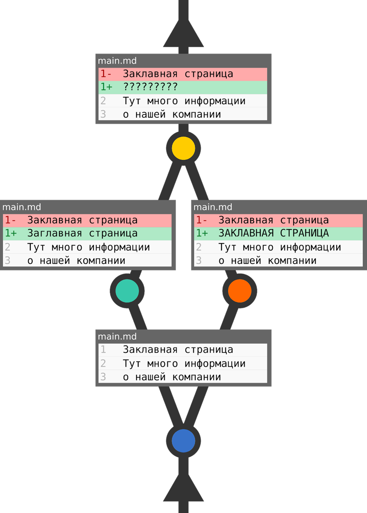

### **Конфликты**
---
При работе с исходным кодом часто встречаются ситуации, когда один и тот же код редактируется разными разработчиками одновременно. При слиянии программного кода в этом случае система контроля версий не может определить, какой код считается правильным.

Возьмём простой пример. Одному разработчику поставили задачу изменить текст на главной странице. Второй разработчик должен изменить оформление этого же текста. Если задачи осуществлялись параллельно, то получается, что один и тот же участок кода изменён обоими разработчиками. Какая в этом случае версия является верной? Однозначно определить нельзя. Это и называется конфликтом.

Бывают и другие конфликты. Но чаще всего происходят именно такие.

**Разрешение конфликтов объединений** 

Если слияние не произошло автоматически, git помещает индекс и рабочий катвалог в специальное состояние содержащее всю необходимую информацию чтобы помочь разрешить конфликт слияния. Файлы с конфликтами помечены в индексе специально, так, что до тех пор, пока вы решите проблему и не обновите индекс, совершить git-commit(1) не удастся:
~~~
$ git commit
file.txt: needs merge file.txt
#необходимо объединить file.txt 
~~~
Кроме того, в git-status будут перечислены эти файлы, как “unmerged” (необъединённые), а файлы с конфликтами будет помечены маркерами конфликта, например:
~~~
<<<<<<< HEAD:file.txt
Hello world
======
Goodbye
>>>>>>> 77976da35a11db4580b80ae27e8d65caf5208086:file.txt 
~~~

Все, что вам необходимо сделать, это отредактировать файлы для разрешения конфликтов, а затем дать команды
~~~
$ git add file.txt
$ git commit 
~~~

Заметим, что сообщение коммита будет уже заполнен ддя вас некоторой информацией о слиянии. Конечно, вы можете просто использовать это сообщение по умолчанию без изменений, однако вы можете, если посчитаете нужным, добавить свои комментарии.

Выше описанное всё, что вам необходимо знать для решения простых слияния.

[<< К оглавлению](./readme.md)