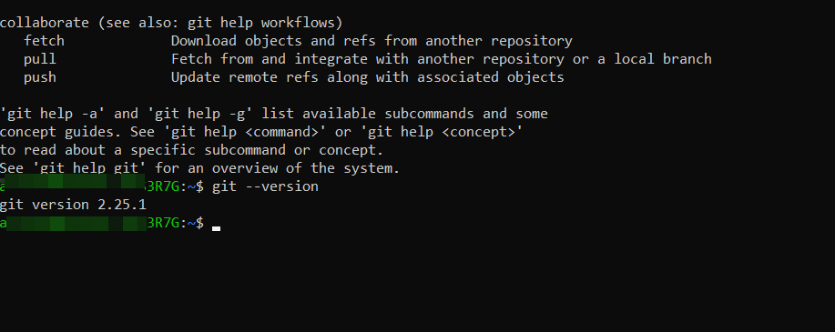

## **Установка Git**
---
***Windows***

Проверка наличия Git:

```
git --version
```

Если Git уже был установлен, вам отобразится его версия:


Для установки Git перейдите на [страницу](https://git-scm.com/download/win), скачайте подходящий дистрибутив и следуйте инструкциям.

***LInux Ubuntu (CLI apt)***

Проверка наличия Git
```
git --version
```
	

Выполните в терминале команду:
```
$ sudo apt install git
```

***Установка Git в MacOS***

Самый простой — установить Xcode Command Line Tools. В версии Mavericks (10.9) и выше вы можете добиться этого, выполнив в терминале:
```
19.	$ git --version
```
Если Git не установлен, вам будет предложено его установить. 

Установщик Git для OS X доступен для скачивания с сайта [Git](http://git-scm.com/download/mac).

***Другие способы установки***


Существует огромное количество способов установки Git. Смотрите их в [официальной документации](https://git-scm.com/book/ru/v2/%D0%92%D0%B2%D0%B5%D0%B4%D0%B5%D0%BD%D0%B8%D0%B5-%D0%A3%D1%81%D1%82%D0%B0%D0%BD%D0%BE%D0%B2%D0%BA%D0%B0-Git).


[<< К оглавлению](./readme.md)