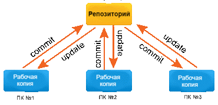
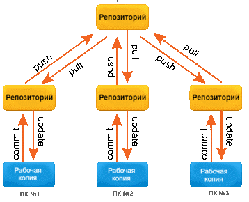

## **Система контроля версиями**
---

**Система контроля версий *(Version Control System, VCS)*** представляет собой программное обеспечение, которое позволяет отслеживать изменения в документах, при необходимости производить их откат, определять, кто и когда внес исправления и т.п.

VCS отслеживает изменения в файлах, предоставляет возможности для создания новых и слияние существующих ветвей проекта, производит контроль доступа пользователей к проекту, позволяет откатывать исправления и определять кто, когда и какие изменения вносил в проект. 

Основным понятием VCS является **репозиторий *(repository)*** – специальное хранилище файлов и папок проекта, изменения в которых отслеживаются. В распоряжении разработчика имеется так называемая “рабочая копия” (working copy) проекта, с которой он непосредственно работает. 

Рабочую копию необходимо периодически синхронизировать с репозиторием, эта операция предполагает отправку в него изменений, которые пользователь внес в свою рабочую копию (такая операция называется ***commit***) и актуализацию рабочей копии, в процессе которой к пользователю загружается последняя версия из репозитория (этот процесс носит название ***update***).

Системы контроля версий можно разделить на две группы:

- ***централизованные***

- ***распределенные***

**Централизованная**

1. Существует только один репозиторий.
2. Простые номера версий файлов (1, 2, 3 и т.д.).
3. У пользователей хранится только текущая версия проекта.
4. Требуется подключение к интернету.
5. Просто, но медленно.
6. Сложности в одновременной работе над одним файлом

**Распределенная**

На один проект приходится много репозиториев.
1.	Каждый пользователь создает локальную копию всего репозитория на основе главного облачного.
2.	Номера версий сложные.
3.	Возможность работать офлайн.
4.	Работать быстро и удобно.
5.	Требуется синхронизация репозиториев, так как проект — один.

[<< К оглавлению](./readme.md)